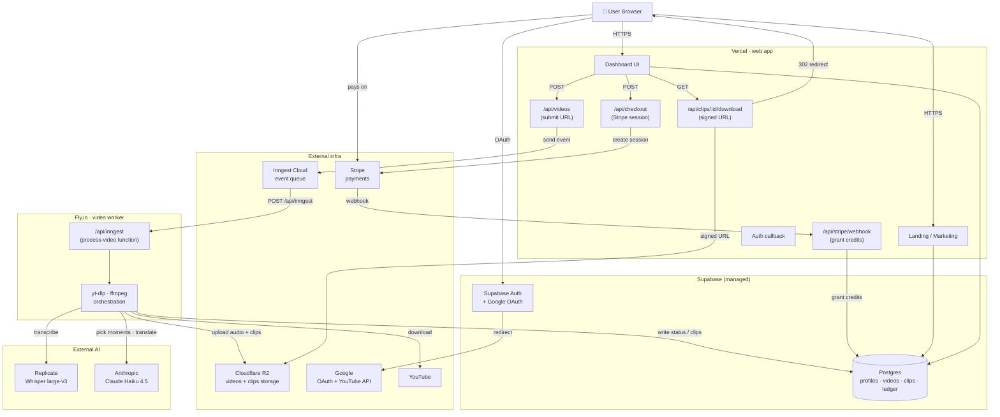
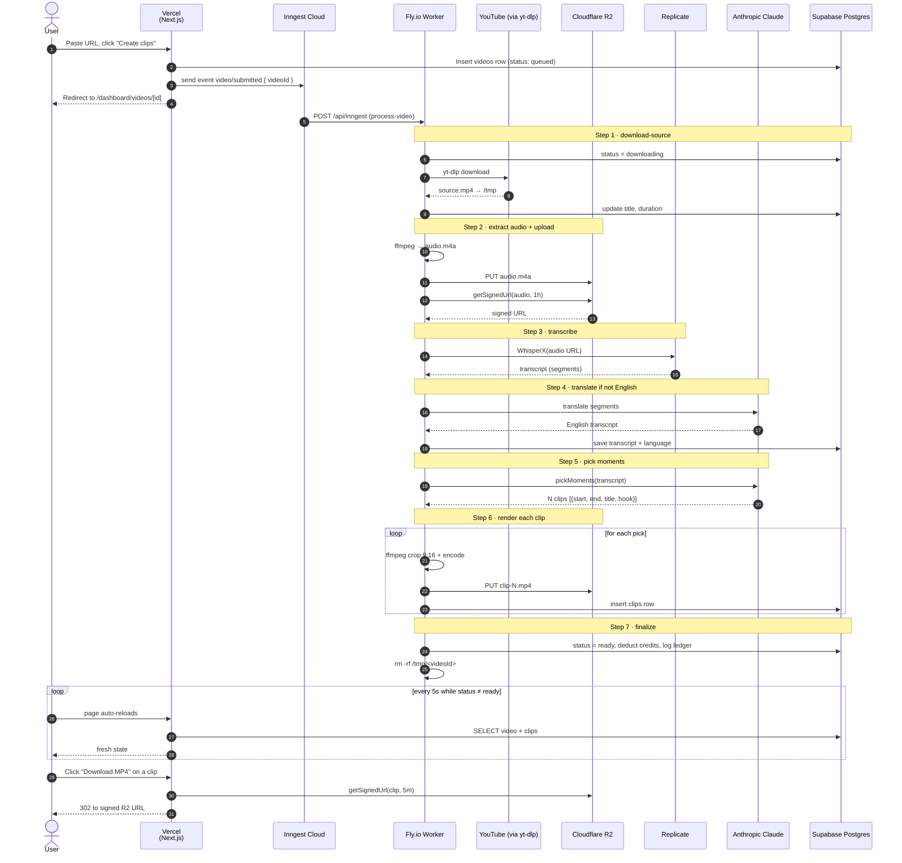
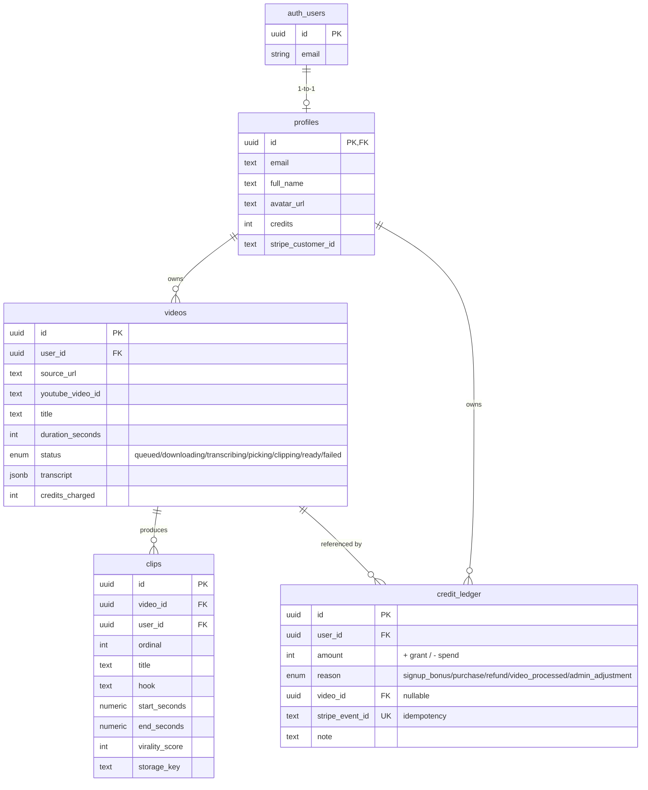
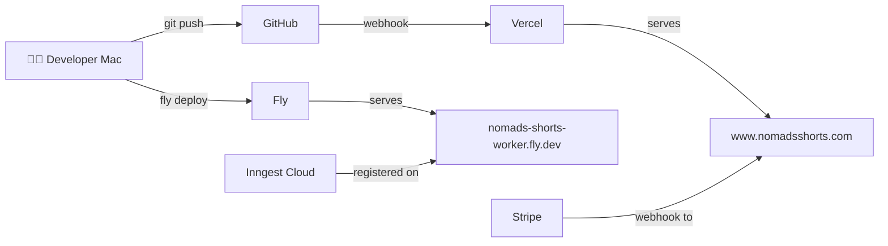

# Nomads Shorts — Technical Architecture

_Last updated: 30 July 2026_

## 1. What this is

Nomads Shorts is a web application that turns long-form YouTube videos (up
to 30 minutes) into 5–10 vertical short clips ready to post on
Reels / Shorts / TikTok. It's aimed at travel vloggers.

The whole thing is a solo-founder SaaS running on cheap hosted
infrastructure. Nothing on-prem, no Kubernetes, no self-hosted databases.
Every piece is either a managed service or a single-machine container.

## 2. High-level architecture

Two apps, same codebase, deployed separately:

- **Vercel** hosts the user-facing web app. It's fast, edge-cached, and
  handles anything short-lived (auth, DB reads, Stripe checkout,
  webhooks).
- **Fly.io** hosts a copy of the same Next.js app that only exists to
  serve `/api/inngest`. It's where yt-dlp and ffmpeg actually run,
  because Vercel's serverless functions cap at 60 seconds and our video
  jobs take 5–15 minutes.

Inngest is registered to call **only** the Fly.io endpoint. Vercel's
copy of `/api/inngest` exists but never gets hit.

## 3. End-to-end request flow

The most interesting flow — user submits a URL, waits, gets clips:

Each numbered step in the Inngest function is a **durable checkpoint**:
if any step fails, Inngest retries from that step, not from scratch.

## 4. Component breakdown

| Component | What runs there | Why here |
|---|---|---|
| **Vercel** | Next.js 16 app (App Router). Serves landing, dashboard, auth callbacks, Stripe checkout + webhook, clip download route. | Best-in-class Next.js hosting, generous free tier, global edge network. |
| **Fly.io** | Same Next.js app in a Docker container with `yt-dlp` and `ffmpeg` installed. Only `/api/inngest` is exercised in production. | Vercel functions cap at 60s. Fly runs a real long-lived container that can encode video for as long as needed. |
| **Supabase** | Postgres database, Auth (with Google OAuth provider). | One managed service for auth + DB with RLS built in. |
| **Cloudflare R2** | Object storage for source videos + rendered clips. | S3-compatible, cheap, and **zero egress fees** — critical for a video app. |
| **Inngest Cloud** | Durable event queue. Registers our `process-video` function, invokes it via webhook to Fly.io, handles retries and step-level replay. | Removes the need to run our own queue/worker infra. |
| **Replicate** | Runs `victor-upmeet/whisperx` for transcription. | Managed GPU inference, pay per minute, no cold-start hell of running Whisper ourselves. |
| **Anthropic** | Claude Haiku 4.5 for moment picking + translation. | Cheap, fast, and its structured-JSON output is reliable. |
| **Stripe** | Checkout Sessions for credit purchases; webhook to grant credits. | Standard payments. Live-mode account activated in Switzerland. |
| **Google OAuth** | Sign-in provider (with YouTube read-only scope pre-requested for future use). | Almost every user has a Google account. |
| **GoDaddy** | `nomadsshorts.com` domain + DNS. | Cheap registrar. DNS records point at Vercel (`216.198.79.1` A record, CNAME to Vercel's DNS). |

## 5. Data model

- `profiles.credits` is a denormalized cache of the current balance.
  The `credit_ledger` is the source of truth (append-only, auditable).
- `credit_ledger.stripe_event_id` is UNIQUE — this is the idempotency
  key for Stripe webhook retries. If Stripe delivers the same
  `checkout.session.completed` twice, the second insert fails cleanly
  and we don't double-credit.
- The signup trigger on `auth.users` automatically creates a `profiles`
  row and grants 15 free credits.

## 6. Security model

- **Auth:** Google OAuth via Supabase. Session cookies are HTTP-only,
  set by Supabase's server client, refreshed by `src/proxy.ts` on every
  request.
- **Row-level security (RLS):** Every table has policies restricting
  users to their own rows (`auth.uid() = user_id`). Even a leaked
  `anon` key can only read the current user's data.
- **Service role key:** Used exclusively by (a) the Stripe webhook to
  grant credits and (b) the video worker to write status/clips. Never
  reaches the browser. Kept in Vercel + Fly secrets only.
- **Signed URLs everywhere:** No R2 bucket is public. Both audio-for-
  Replicate and clip-for-user downloads go through short-lived signed
  URLs (1h and 5m respectively).
- **Route protection:** `src/proxy.ts` gates `/dashboard/*` and
  `/api/protected/*` on being signed in; unauthenticated hits redirect
  to `/sign-in`.

## 7. Deployment topology

- Web app auto-deploys on every push to `main` (Vercel + GitHub
  integration).
- Fly worker deploys manually with `fly deploy` from the `web/` folder.
  Same source, different runtime.
- Both share the same env-var / secret values (Supabase, R2, Anthropic,
  Replicate, Stripe, Inngest keys) — Vercel via UI, Fly via
  `fly secrets set`.

## 8. Costs

### Fixed monthly costs

| Item | Cost | Notes |
|---|---:|---|
| **Fly.io worker** (shared-cpu-4x, 4GB RAM, 1 machine always on) | **~USD 15/mo** | The only fixed compute bill. Could go down to `shared-cpu-2x` (~$8/mo) if you're willing to accept slower ffmpeg. |
| **GoDaddy domain** (nomadsshorts.com) | **~USD 1.25/mo** | Annual bill of ~$15/yr; renews yearly. |
| **Vercel Hobby** | **USD 0** | Free plan is enough for hobby volumes. Upgrade to Pro at $20/mo if/when you hit 100k requests/mo or need longer function timeouts. |
| **Supabase Free** | **USD 0** | 500 MB DB, 1 GB storage (unused), 50k monthly active users. Room to grow. |
| **Cloudflare R2 Free** | **USD 0** | 10 GB storage + 10M reads + unlimited egress. We're using <1 GB. |
| **Inngest Free** | **USD 0** | 50k events/month. Each video submission is ~10-15 events. Room for ~4,000 videos/mo. |
| **Google OAuth** | **USD 0** | Free forever. |
| **Total fixed** | **~USD 16.25/mo** | |

### Variable costs (per video processed)

| Service | Cost per 20-min video | Notes |
|---|---:|---|
| **Replicate** (WhisperX transcription) | ~USD 0.12 | ~$0.006/min |
| **Anthropic** (Claude Haiku moment-pick + translation) | ~USD 0.02 | ~2,000 input tokens + 500 output |
| **R2 storage + bandwidth** | <USD 0.001 | Source stored briefly, clips ~5 MB each |
| **Total per video** | **~USD 0.14** | For a longer 30-min source: ~USD 0.20 |

### Revenue vs cost per credit pack

| Pack | Sale price | Stripe fee (2.9% + $0.30) | ~AI cost | ~Profit |
|---|---:|---:|---:|---:|
| Starter (60 credits, ~2 hr of video) | USD 9.00 | USD 0.56 | USD 0.84 | **USD 7.60** |
| Creator (300 credits, ~10 hr) | USD 39.00 | USD 1.43 | USD 4.20 | **USD 33.37** |
| Pro (900 credits, ~30 hr) | USD 99.00 | USD 3.17 | USD 12.60 | **USD 83.23** |

_Profit here is contribution margin, before fixed infrastructure._

### Cost at scale

Assuming average customer buys the Creator pack ($39) once and uses
half their credits (~5 hours of video processed) that month:

| Users active/mo | Videos/mo (est.) | Fixed | Variable | Revenue (Stripe fees deducted) | **Net** |
|---:|---:|---:|---:|---:|---:|
| 10 | 30 | $16 | $4 | ~$375 | **+$355** |
| 100 | 300 | $16 | $42 | ~$3,750 | **+$3,690** |
| 1,000 | 3,000 | $16 | $420 | ~$37,500 | **+$37,000** |

At ~500 active users you should upgrade:
- Vercel Pro (**+$20/mo**) — for longer function times + more requests
- Fly to `performance-2x` or scale to 2 machines (**+$15-25/mo**)
- Supabase Pro (**+$25/mo**) if you cross 50k MAU

Still trivial relative to revenue. This is a very cheap business to run.

## 9. What is NOT in this design

Deliberate omissions:

- **No self-hosted GPU** — Whisper runs on Replicate, no complexity
  managing our own inference.
- **No custom queue / worker code** — Inngest handles it; if we
  outgrow the free tier, we still don't have to run infrastructure.
- **No face-tracking reframe** — currently a fixed center crop. Real
  face-tracking is a real project (OpenCV, smoothing filter over face
  bboxes) and adds meaningful CPU + complexity. Deferred.
- **No CDN in front of R2 clips** — R2 is already a CDN. If clips
  become viral traffic later, we could layer Cloudflare's public
  bucket + signed URLs on top.
- **No email delivery yet** — pipeline completion doesn't email the
  user. Adding Resend or Postmark is a small future task.
- **No admin panel** — day-to-day admin is done via SQL in the Supabase
  editor.
- **No test suite yet** — MVP shipped fast. Regression coverage is a
  known follow-up.

## 10. Where to find things

- **Frontend + API routes:** `web/src/app/`
- **Pipeline modules:** `web/src/lib/pipeline/`
- **Inngest functions:** `web/src/inngest/`
- **Database migration:** `web/supabase/migrations/0001_init.sql`
- **Docker config:** `web/Dockerfile`, `web/.dockerignore`
- **Fly config:** `web/fly.toml`
- **Env template:** `web/.env.example`
- **Legal:** `web/src/app/legal/{terms,privacy}/page.tsx`
- **Marketing demo:** `web/src/app/demo/page.tsx`
